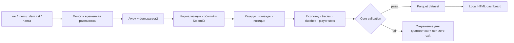

<div align="center">

# CS2 Demo Parser

### Один клик от `.rar` или `.dem` до подробной аналитики матча

[](https://github.com/loldigidon/CS2-DEMO-PARSER/actions/workflows/ci.yml)
[](https://www.python.org/)
[](https://github.com/pnxenopoulos/awpy)
[](LICENSE)
[](#windows-один-запуск-без-команд)
[](#приватность-и-сеть)

**Демо остаются на вашем компьютере.** Парсер находит все матчи в архиве или папке,
извлекает игровые события, считает метрики, сохраняет Parquet-таблицы и собирает
автономный FACEIT-style dashboard с покадровым радаром.

[Скачать](https://github.com/loldigidon/CS2-DEMO-PARSER/archive/refs/heads/main.zip) · [Быстрый старт](#быстрый-старт) · [Скриншоты](#как-выглядит-результат) · [Dashboard](#dashboard) · [CLI](#режимы-cli)

</div>

---

## Как выглядит результат

<p align="center">
  
</p>

<table>
  <tr>
    <td width="50%">
      
      <br><sub><b>Весь BO3 на одной странице.</b> Архив обрабатывается целиком, отдельный запуск для каждой карты не нужен.</sub>
    </td>
    <td width="50%">
      
      <br><sub><b>Интерактивный round playback.</b> Позиции, траектории, utility, события и вклад каждого игрока.</sub>
    </td>
  </tr>
</table>

> Скриншоты собраны проектом из реального BO3 с картами Anubis, Mirage и Dust2.
> Исходные демки и сгенерированные данные в репозиторий не включены.

## Зачем он нужен

- **Игрокам и тренерам** — быстро разобрать счёт, дуэли, экономику, utility и движение по карте.
- **Аналитикам** — получить нормализованный Parquet dataset вместо ручного извлечения событий.
- **Разработчикам** — использовать проверенный event layer, manifest и validation report в своих инструментах.
- **Организаторам** — обработать целую папку или BO3/BO5-архив одной командой.

## Что умеет проект

| Область | Возможности |
|---|---|
| **Входные данные** | `.rar`, `.dem`, `.dem.zst`, папки с архивами и демками, имена вида `match.dem(1).zst` |
| **Базовые события** | раунды, убийства, урон, выстрелы, гранаты, дым, огонь, бомба, шаги, перезарядки |
| **Игровая аналитика** | ADR, KAST, openings, strict trades, clutch attempts/wins, buy outcomes, economy snapshots |
| **Продвинутые метрики** | Rating, Swing, RWS, S. Accuracy и расстояние до калибровочной выборки |
| **Позиции** | sampled player positions, траектории, направление взгляда, round radar playback |
| **Карты** | встроенные радары Anubis, Mirage, Dust2 и других основных карт; отдельные верхний/нижний этажи Nuke |
| **Экспорт** | атомарно записанные Parquet-таблицы, raw-event layer, manifest и validation report |
| **Визуализация** | автономные `index.html` и `standalone.html`, сортируемые таблицы, раунды, дуэли, utility и экономика |

### Важные гарантии корректности

- tickrate определяется по реальному `game_time`, если не задан вручную;
- SteamID64 нормализуется в строку без потери точности;
- трейд засчитывается только при убийстве исходного киллера в том же раунде и временном окне;
- стороны CT/T восстанавливаются по составам раунда, если они отсутствуют в тиках;
- активная установка бомбы отделяется от post-round событий;
- результат получает статус `[ok]` только после обязательной core-валидации;
- тяжёлый inventory не дублируется на каждом тике: нужные данные читаются из разреженных событий.

## Как устроен pipeline



## Требования

- Python **3.11, 3.12 или 3.13**;
- для `.rar`: установленный **7-Zip** или **WinRAR/UnRAR**; обычные `.dem` и `.dem.zst` работают без них;
- достаточно свободного места для распакованной демки и Parquet-результата;
- RAM зависит от длины матча и включённых событий; `--all-raw-events` заметно тяжелее стандартного режима.

## Быстрый старт

### Windows: один запуск без команд

1. [Скачайте ZIP проекта](https://github.com/loldigidon/CS2-DEMO-PARSER/archive/refs/heads/main.zip) и распакуйте его.
2. Дважды нажмите [`START.bat`](START.bat).
3. Выберите `.rar`, `.dem`, `.dem.zst` или папку с несколькими архивами/демками.
4. Нажмите **«Запустить всё»**.

При первом запуске скрипт сам создаст `.venv` и установит зависимости. Все найденные
демки будут распарсены, dashboards собраны, а затем откроется общая страница матчей.
Файл или папку также можно перетащить прямо на `START.bat`.

> Для RAR нужен установленный [7-Zip](https://www.7-zip.org/) или WinRAR/UnRAR.
> Для обычных `.dem` и `.dem.zst` архиватор не требуется.

### 1. Установка из исходников для CLI

```bash
python -m venv .venv

# Windows PowerShell
.venv\Scripts\Activate.ps1

# Linux / macOS
source .venv/bin/activate

python -m pip install --upgrade pip
python -m pip install -e .
```

Для разработки и тестов:

```bash
python -m pip install -e ".[dev]"
```

Альтернативно можно установить зависимости из файлов:

```bash
python -m pip install -r requirements.txt
python -m pip install -r requirements-dev.txt  # тесты и сборка
```

### 2. Проверка CLI

```bash
cs2-demo-parser --version
cs2-demo-parser --help
```

До установки editable-package те же команды доступны как `python main.py ...`.

### 3. Парсинг и dashboard

```bash
cs2-demo-parser series.rar --mode parse-viz --out output --no-serve

# Или вся папка: архивы и демки ищутся рекурсивно
cs2-demo-parser path/to/tournament --mode parse-viz --out output --no-serve

cs2-demo-parser match.dem.zst \
  --mode parse-viz \
  --out output \
  --no-serve
```

Результат:

```text
output/<match-id>/
├── *.parquet
├── events/
├── validation.parquet
└── visualization/
    ├── index.html
    └── standalone.html
```

Откройте `output/<match-id>/visualization/index.html` обычным двойным кликом.

## Режимы CLI

### Интерактивное меню

```bash
cs2-demo-parser
```

Приложение предложит выбрать режим, архив/демку, output-папку и запуск браузера.
При обнаружении нескольких матчей вариант **«Все файлы»** выбран по умолчанию.

### Только парсер

```bash
cs2-demo-parser match.dem --mode parse --out output
cs2-demo-parser match.dem.zst --mode parse --out output
```

### Парсер + визуализация

```bash
cs2-demo-parser match.dem.zst --mode parse-viz --out output
```

По умолчанию после сборки запускается локальный HTTP-сервер и открывается браузер. Для CI или headless-среды:

```bash
cs2-demo-parser match.dem.zst --mode parse-viz --out output --no-serve
```

### Визуализация готового матча

```bash
cs2-demo-parser output/<match-id> --mode visualize
cs2-demo-parser output/<match-id> --mode visualize --no-serve
```

### Папка с архивами и демками

```bash
cs2-demo-parser demos/ --mode parse --out output
```

Поиск рекурсивный: папка может одновременно содержать `.rar`, `.dem` и `.dem.zst`.
RAR распаковывается во временную системную папку и автоматически удаляется после обработки.

### Полезные параметры

```bash
# Не сохранять sampled positions
cs2-demo-parser match.dem --no-positions

# Сохранять каждую 32-ю позицию
cs2-demo-parser match.dem --position-sample 32

# Только стандартный набор событий Awpy
cs2-demo-parser match.dem --core-events-only

# Каждый обнаруженный raw engine event — медленно и требует много RAM
cs2-demo-parser match.dem --all-raw-events

# Принудительный tickrate, только если он точно известен
cs2-demo-parser match.dem --tickrate 64

# Не извлекать тяжёлые таблицы
cs2-demo-parser match.dem --skip-shots --skip-footsteps

# Не считать ошибку core-валидации ошибкой процесса
cs2-demo-parser match.dem --allow-partial
```

## Batch pipeline по manifest.json

```bash
cs2-demo-pipeline \
  --tournament-root path/to/tournament \
  --output-dir output \
  --skip-existing
```

Ожидаемая структура:

```text
<tournament-root>/
├── index/
│   └── manifest.json
└── <corePath из manifest>/
    └── match.dem.zst
```

Основные параметры:

```bash
cs2-demo-pipeline --help
cs2-demo-pipeline --limit 5
cs2-demo-pipeline --all-raw-events
cs2-demo-pipeline --no-positions
```

`--skip-existing` пропускает матч только при наличии обязательных таблиц, непрерывных уникальных раундов и отсутствии error-level failures в `validation.parquet`.

## Dashboard

Dashboard собирается в статические HTML/CSS/JS/JSON-файлы и содержит:

- итоговый счёт, MVP и пять таблиц статистики игроков;
- Rating/Swing, RWS, K/D/A, ADR, KAST, accuracy, entries, trades и clutch breakdown;
- матрицу личных дуэлей;
- использование HE/flash/smoke/molotov/incendiary/decoy и utility outcomes;
- экономику по раундам: командный equipment value, остаток денег и тип закупа;
- freeze-time loadout каждого игрока;
- выбор раунда, позиции по тикам, направления взгляда и траектории игроков;
- траектории гранат, точки приземления, smoke/fire areas и utility feed;
- kill feed, winner/reason/bombsite и per-round player/team cards;
- два этажа Nuke с режимами **Оба / Верх / Низ**.

`index.html` и `standalone.html` встраивают данные, стили, JavaScript и радар. Они не требуют локального сервера после генерации.

### Пользовательские радары

```bash
cs2-demo-parser output/<match-id> \
  --mode visualize \
  --radar-dir path/to/radars
```

Поддерживаются `*_radar.dds` и PNG-файлы.

## Структура результата

```text
output/<match-id>/
├── header.parquet
├── parse_metadata.parquet
├── validation.parquet
├── event_manifest.parquet
├── rounds.parquet
├── round_sides.parquet
├── teams.parquet
├── ticks.parquet
├── positions_sampled.parquet
├── kills.parquet
├── damages.parquet
├── shots.parquet
├── fire_bullets.parquet
├── grenades.parquet
├── smokes.parquet
├── infernos.parquet
├── bomb.parquet
├── footsteps.parquet
├── flashes.parquet
├── reloads.parquet
├── buys.parquet
├── trades.parquet
├── opening_kills.parquet
├── buy_outcomes.parquet
├── clutch_attempts.parquet
├── clutches.parquet
├── player_stats.parquet
├── events/
│   ├── manifest.json
│   └── <raw-event>.parquet
└── visualization/
    ├── index.html
    ├── standalone.html
    ├── styles.css
    ├── app.js
    ├── data.json
    └── radar.png
```

`events/` — полный сырой событийный слой, включая события до первого официального раунда. Удобные корневые event-таблицы предназначены для анализа матча и исключают строки без `round_num`.

## Определения метрик

### Strict trade

Убийство считается трейдом, когда:

1. игрок **A** убил игрока **B**;
2. товарищ **B** по команде убил именно **A**;
3. оба события произошли в одном раунде;
4. разница времени не превышает `trade_seconds` — по умолчанию **5 секунд**.

Промежуточные убийства между death и refrag не ломают поиск трейда.

### Активная установка бомбы

Установка влияет на `bomb_site` раунда только внутри интервала:

```text
freeze_end <= plant_tick <= round_end
```

Установки между `round_end` и `official_end` учитываются в `postround_plant_count`, но не заменяют активный bombsite.

### SteamID64

Все `steamid`, `*_steamid` и `*_xuid` сохраняются как точные десятичные строки. Не преобразовывайте их в `float64` при последующей аналитике.

### Rating, Swing, RWS и S. Accuracy

Продвинутые показатели — локальные demo-only модели. Поля `rating_calibration_distance` и `advanced_calibration_distance` показывают расстояние нового профиля до calibration anchors. Чем дальше профиль, тем осторожнее следует интерпретировать экстраполяцию.

Калибровочные параметры поставляются внутри пакета, а контрольные примеры —
в `tests/reference/`. Это позволяет проверять модели в CI без публикации демо-файлов.

## Пересчёт производных метрик

Когда демки уже нет, но базовые Parquet-таблицы сохранены:

```bash
python scripts/rebuild_derived_metrics.py \
  --output output \
  --match <match-id>
```

Tickrate читается из `parse_metadata.parquet`; при необходимости используйте `--tickrate`.

## Приватность и сеть

- демка, Parquet-таблицы и dashboard генерируются локально;
- проект не отправляет содержимое матча во внешние API и не создаёт AI-датасеты;
- локальный сервер по умолчанию слушает `127.0.0.1`;
- generated output может содержать SteamID, имена, позиции и детали матча — проверяйте его перед публикацией;
- SVG-силуэты предметов являются необязательным UI-слоем и могут запрашиваться у community-репозитория `Juknum/counter-strike-icons`; при отсутствии сети остаются текстовые подписи, а данные матча в запрос не передаются.

## Разработка и релиз

```bash
python -m pip install -e ".[dev]"
python -m compileall -q config.py main.py launcher.py pipeline.py cs2parser scripts tests
python -m pytest -q
python -m build
python -m twine check dist/*

# Полный smoke test на реальной демке
python scripts/release_smoke_test.py match.dem.zst --out release-smoke-output
```

В репозитории подготовлены:

- CI matrix для Python 3.11–3.13;
- проверка wheel/sdist;
- tagged GitHub Release workflow;
- Dependabot для Python и GitHub Actions;
- issue forms и pull-request template;
- [`CONTRIBUTING.md`](CONTRIBUTING.md), [`SECURITY.md`](SECURITY.md) и [`RELEASE_CHECKLIST.md`](RELEASE_CHECKLIST.md).

Tagged release:

```bash
git tag v0.1.0
git push origin v0.1.0
```

Workflow соберёт wheel и source distribution и прикрепит их к GitHub Release.

## Ограничения

- Набор низкоуровневых событий зависит от версии CS2, Awpy и содержимого конкретной демки.
- POV demos обычно менее полны, чем GOTV demos.
- Некоторые player properties могут отсутствовать; пропуски отражаются в manifest и validation.
- `--all-raw-events` выполняет дополнительный полный проход и может потреблять много памяти.
- Продвинутые FACEIT-style метрики являются локальными калиброванными моделями, а не официальной серверной реализацией FACEIT.

## Лицензия и атрибуция

Код распространяется по лицензии [MIT](LICENSE).

Проект использует [Awpy](https://github.com/pnxenopoulos/awpy) и community radar/icon assets. Counter-Strike, игровые названия и оригинальные ассеты принадлежат Valve Corporation; перед коммерческим распространением проверьте права на включённые сторонние материалы.
